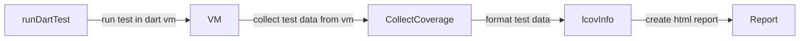
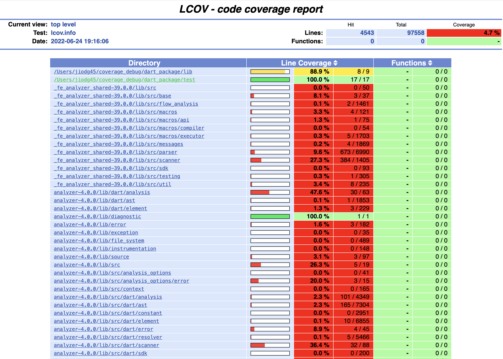
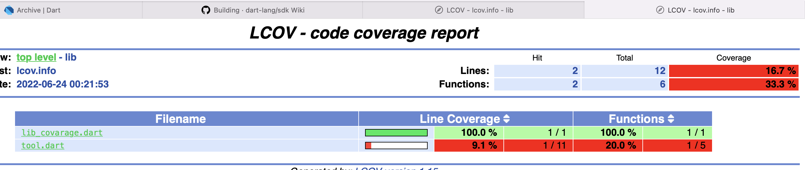

## Coverage new changes

- support function and branch test analyze
- could got the sytem package code excute coverage also

- Support versions (on doing)
 
|summary  |  dart vm  | flutter | coverage |  dart package                                    | flutter package                                 | 
|---|---|---|---|---|---|
|env1 |  2.17     |  2.8.0 | 1.3.0    |  [true](./coverage-2.17-dartpackage/index.html)  | [false](./md_resources/flutter_2.8.0_test.txt)  | 
|env2 |  2.17     |  3.0.0 | 1.3.0    |  [true](./coverage-2.17-dartpackage/index.html)  | [false](./md_resources/flutter_2.8.0_test.txt)  | 
|env3 |  2.17     |  3.0.0 | 1.2.0    |  [true](./coverage-2.17-dartpackage/index.html)  | [false](./md_resources/flutter_2.8.0_test.txt)  | 
|env3 |  2.14.4   |  2.5.3 | 1.2.0    |  [true](./coverage-2.17-dartpackage/index.html)  | [false](./md_resources/flutter_2.8.0_test.txt)  | 


## Branch coverage work flow



1. run test command,start the vm, vm record all the test calls

```
dart run --pause-isolates-on-exit --disable-service-auth-codes --enable-vm-service=8181 test
```
2. collect test data for vm
```
collect_coverage --wait-paused --uri=http://127.0.0.1:8181/ -o coverage/coverage.json --resume-isolates --function-coverage --branch-coverage
```

3. format coverage data 
```
format_coverage --packages=.dart_tool/package_config.json --lcov -i coverage/coverage.json -o coverage/lcov.info
```

4. genrate report

```
genhtml -o coverage coverage/lcov.info 
```

## Screen shots 

- collect system package coverage



- function coverage report



## Logs and issues

[flutter-2.5.3-coverage-1.2.0-dart-function-coverage-error.txt](./logs/flutter-2.5.3-coverage-1.2.0-dart-function-coverage-error.txt)  ❌

[flutter-2.5.3-coverage-1.2.0-dart-readme-error.txt](./logs/flutter-2.5.3-coverage-1.2.0-dart-readme-error.txt) ❌

[flutter-3.0.0-coverage-1.3.0-dart-error.txt](./logs/flutter-3.0.0-coverage-1.3.0-dart-error.txt)

[flutter-3.0.0-coverage-1.3.0-flutter-error.txt](./logs/flutter-3.0.0-coverage-1.3.0-flutter-error.txt) ❌

[flutter-3.0.0-coverage-1.3.2-dart-error.txt](./logs/flutter-3.0.0-coverage-1.3.2-dart-error.txt) ❌

[flutter-3.0.0-coverage-1.3.2-dart-success.txt](./logs/flutter-3.0.0-coverage-1.3.2-dart-success.txt)

[flutter-3.0.0-coverage-1.3.2-flutter-error.txt](./logs/flutter-3.0.0-coverage-1.3.2-flutter-error.txt) ❌

[flutter-3.0.0-coverage-1.4.0-dart-success.txt](./logs/flutter-3.0.0-coverage-1.4.0-flutter-error.txt) ❌

## Github relate open issue

https://github.com/dart-lang/coverage/issues/390